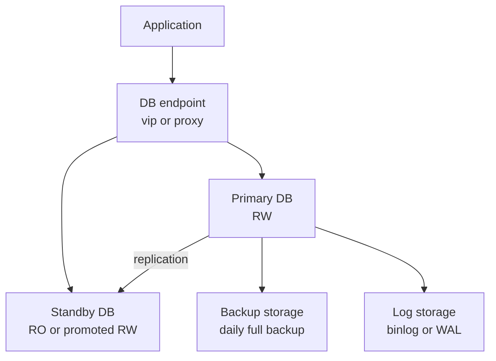

# Домашнее задание к занятию "Резервное копирование баз данных" - Муравский Артем

---

### Задание 1

Кейс

Финансовая компания решила увеличить надёжность работы баз данных и их резервного копирования.

Необходимо описать, какие варианты резервного копирования подходят в случаях:

1.1. Необходимо восстанавливать данные в полном объёме за предыдущий день.

1.2. Необходимо восстанавливать данные за час до предполагаемой поломки.

1.3.* Возможен ли кейс, когда при поломке базы происходило моментальное переключение на работающую или починенную базу данных.

Приведите ответ в свободной форме.

---

# Резервное копирование и отказоустойчивость БД (простые решения)

Контекст: финансовая компания хочет повысить надёжность БД и резервного копирования.
Ниже — самые простые и понятные варианты под 3 кейса.

---

## 1.1 Нужно восстановить данные в полном объёме за предыдущий день

### Самое простое решение: ежедневный полный бэкап (Full Backup)
- Каждый день (например, ночью) делаем **полную копию** всей базы.
- Кладём бэкап **в отдельное хранилище** (другой сервер/объектное хранилище).
- Держим ретеншн, например 7–30 дней.
- Периодически проверяем, что бэкап реально восстанавливается (тестовое восстановление).

**Как восстанавливаем:**
- Берём **вчерашний** полный бэкап.
- Разворачиваем базу из него целиком.

**Что даёт:**
- Максимально просто в понимании и эксплуатации.
- Восстановление “на вчера” делается одной операцией.

---

## 1.2 Нужно восстановить данные за час до предполагаемой поломки

### Самое простое решение: Full Backup + журнал изменений (PITR)
Это называется восстановление “до точки во времени” (Point-in-Time Recovery).

**Как настроить:**
1) Делать **полный бэкап** раз в сутки (как в 1.1).  
2) Включить сохранение **журнала транзакций**:
   - MySQL: binlog
   - PostgreSQL: WAL
   - MS SQL: transaction log  
3) Складывать эти журналы в отдельное хранилище.

**Как восстанавливаем “за час до поломки”:**
- Разворачиваем последний полный бэкап.
- Потом “докатываем” журналы транзакций до времени **T-1 час** (например, 14:00, если авария была около 15:00).

**Что даёт:**
- Можно восстановиться максимально близко к нужному времени (не только “на вчера”).
- Требование “за час до поломки” закрывается напрямую.

> Упрощённая альтернатива (если PITR не хотят): делать инкрементальные бэкапы каждый час.
> Но это обычно менее гибко и хуже по точности, чем Full+журналы.

---

## 1.3 Возможен ли кейс мгновенного переключения на работающую/починенную БД

### Да, возможен: репликация + автоматический failover
Самая простая схема: **Primary + Standby replica**.

**Как это работает:**
- Есть основная база (**Primary**, RW).
- Есть реплика (**Standby**, обычно RO), которая постоянно получает изменения.
- При падении Primary система переключает приложение на Standby.

**Что важно понимать (очень просто):**
- Если репликация **асинхронная**: переключение быстрое, но возможна потеря последних секунд/минут данных.
- Если репликация **синхронная**: потерь почти нет, но запись может быть медленнее (потому что подтверждение ждём от реплики).

**Про “моментально”:**
- Реально это обычно секунды/десятки секунд (зависит от мониторинга и переключателя).
- “Починенная база” — обычно возвращается позже и становится новой репликой.

---

## Простая рекомендуемая схема (на пальцах)

---

### Задание 2

2.1. С помощью официальной документации приведите пример команды резервирования данных и восстановления БД (pgdump/pgrestore).

2.1.* Возможно ли автоматизировать этот процесс? Если да, то как?

Приведите ответ в свободной форме.

---

---

### Задание 3

3.1. С помощью официальной документации приведите пример команды инкрементного резервного копирования базы данных MySQL.

3.1.* В каких случаях использование реплики будет давать преимущество по сравнению с обычным резервным копированием?

Приведите ответ в свободной форме.

---

