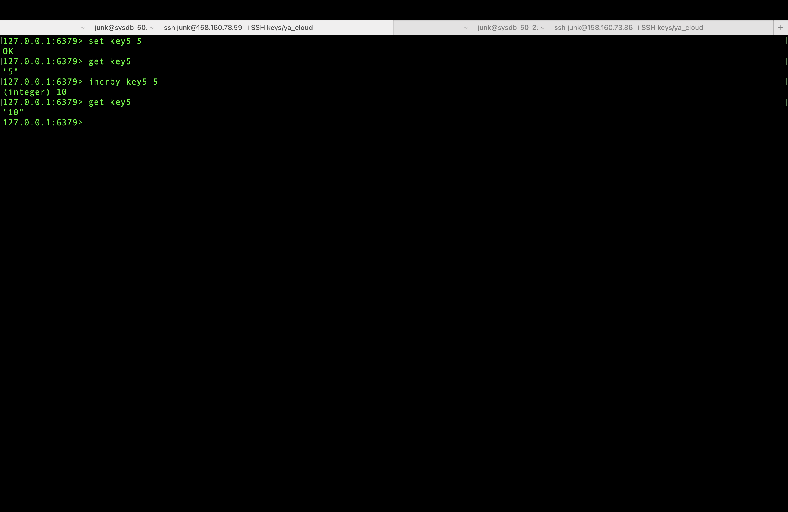
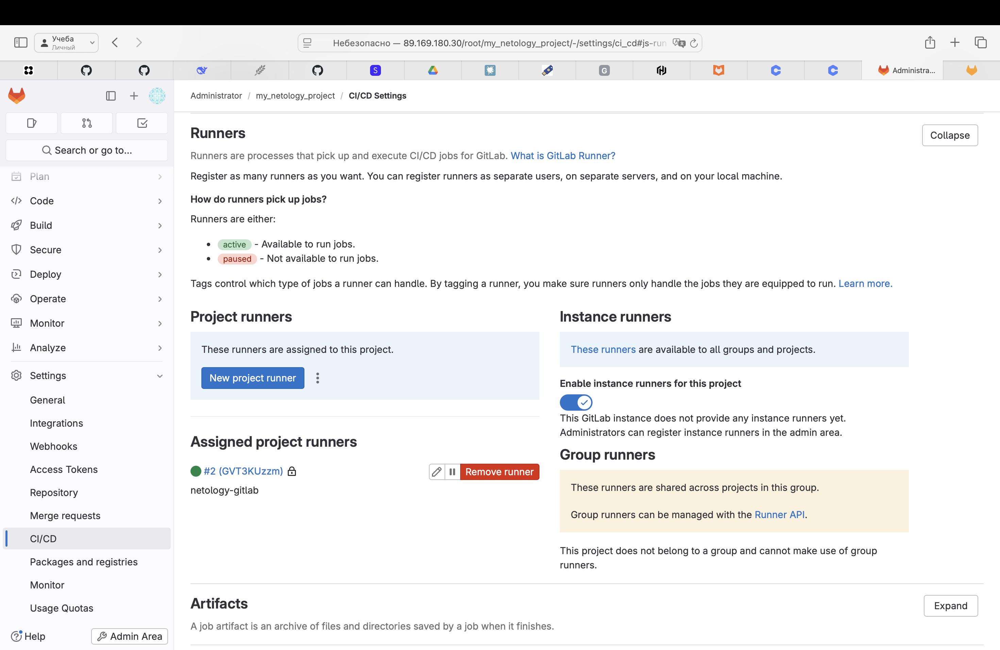
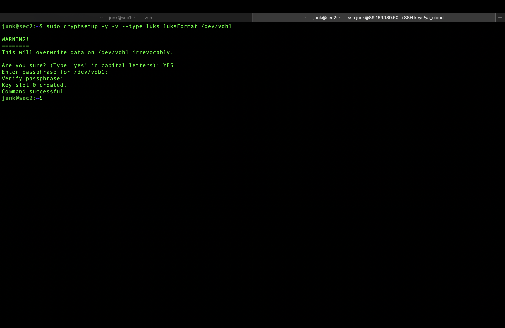
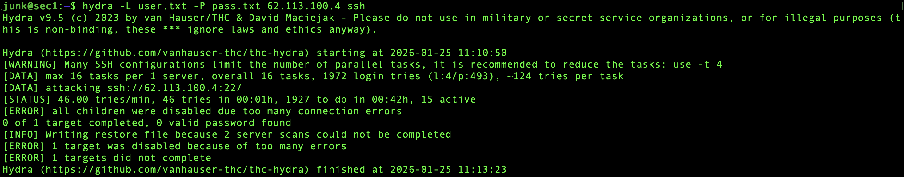
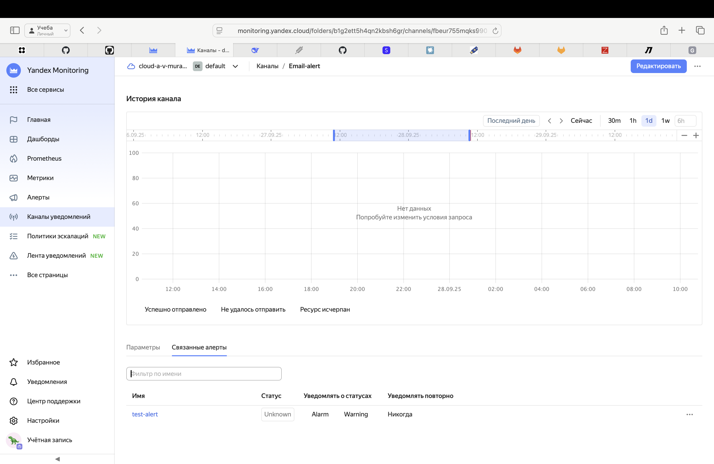
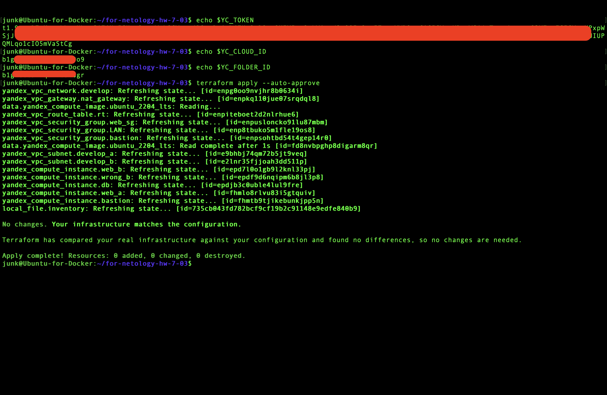
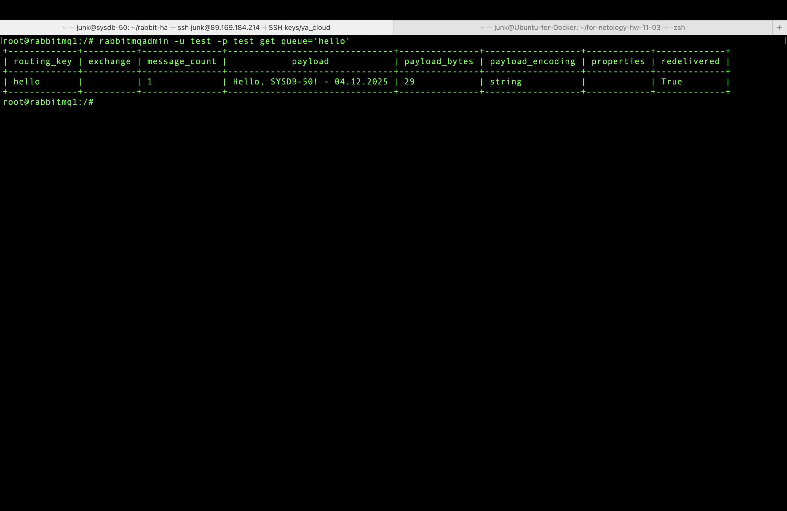
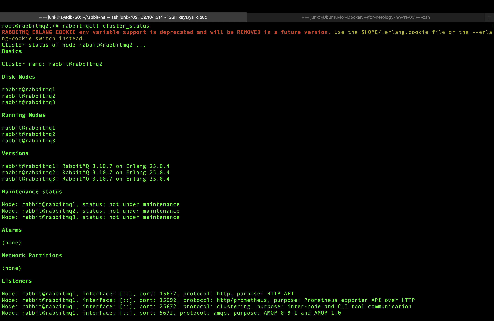
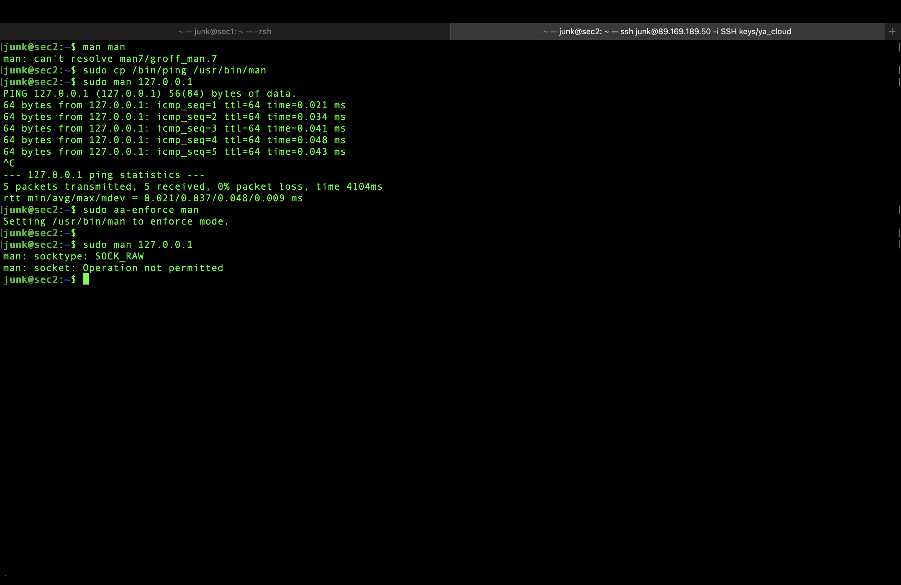
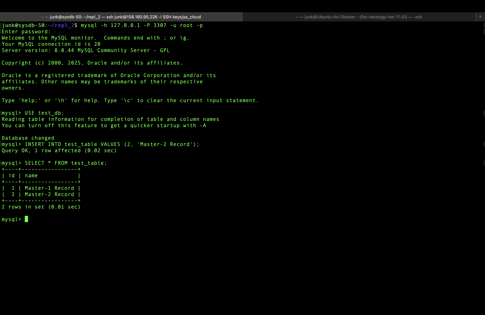

# Домашнее задание к занятию "Репликация и масштабирование. Часть 1" - Муравский Артем

---

### Задание 1

На лекции рассматривались режимы репликации master-slave, master-master, опишите их различия.

Ответить в свободной форме.

*В режиме master-slave клиенты могу осуществлять операции записи только на master-сервере, slave-сервер(-ы) получают изменения от master-сервера и обслуживают только запросы на чтение. В режиме master-master все серверы равнозначны и клиенты могут осуществлять все виды операций на любом из них.*

---

### Задание 2

Выполните конфигурацию master-slave репликации, примером можно пользоваться из лекции.

Приложите скриншоты конфигурации, выполнения работы: состояния и режимы работы серверов.

--

Master-сервер: конфигурация

Master-сервер: вывод команд `SHOW MASTER STATUS\G` и `SELECT * FROM test_table;`

---

Slave-сервер: конфигурация

Slave-сервер: вывод команды `SHOW SLAVE STATUS\G`

Slave-сервер: продолжение вывода команды `SHOW SLAVE STATUS\G` и вывод `SELECT * FROM test_table;`

---

### Задание 3

Выполните конфигурацию master-master репликации. Произведите проверку.

Приложите скриншоты конфигурации, выполнения работы: состояния и режимы работы серверов.

---

Master-1-сервер: конфигурация

Master-1-сервер: вывод команд `SHOW MASTER STATUS\G` и создание в таблице test_db записи "Master-1 Record"

Master-1-сервер: просмотр таблицы test_db на наличии записи "Master-2 Record"

---

Master-2-сервер: конфигурация

Master-2-сервер: вывод команд `SHOW MASTER STATUS\G` и просмотр таблицы test_db на наличии записи "Master-1 Record"

Master-2-сервер: создание в таблице test_db записи "Master-2 Record"

