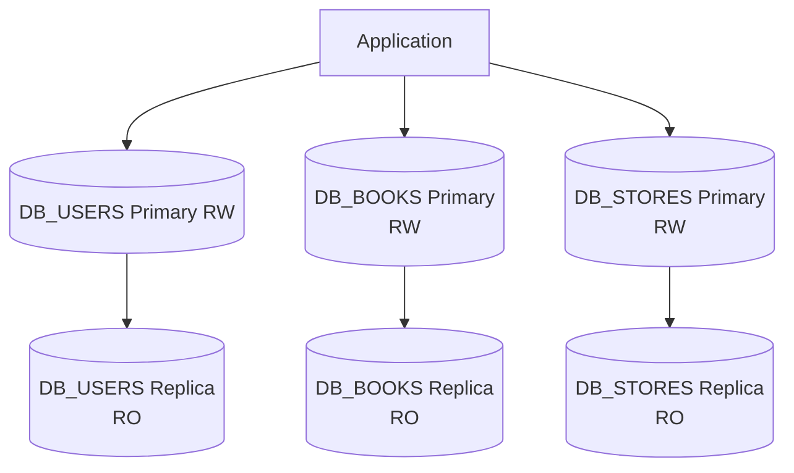
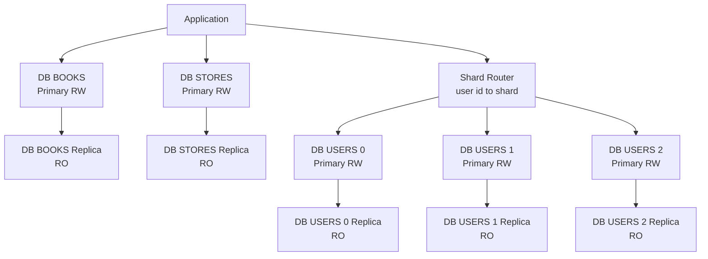

# Домашнее задание к занятию "Репликация и масштабирование. Часть 2" - Муравский Артем


---

### Задание 1

Опишите основные преимущества использования масштабирования методами:

- активный master-сервер и пассивный репликационный slave-сервер;
- master-сервер и несколько slave-серверов.

---

1) Активный master и пассивный slave (реплика)

Как работает:
Master — основной сервер базы данных. На него идут все записи (INSERT/UPDATE/DELETE) и обычно чтение тоже.
Slave — копия, которая получает изменения с master и “держится в готовности”.

Основные преимущества:

- Резерв на случай аварии: если master ломается, slave можно поднять как новый master (вручную или автоматически). Это уменьшает простой.

- Безопаснее обновления и обслуживание: можно обслуживать/проверять часть задач на slave, не трогая master.

- Проще бэкапы: снимки и резервные копии часто делают со slave, чтобы не нагружать master.

- Проще архитектура: минимум компонентов: один пишет, второй копирует — легко объяснить, настроить и поддерживать.

В итоге: меньше простоев и проще эксплуатация при небольшой/средней нагрузке.


2) Master и несколько slave-серверов

Как работает:
Master по-прежнему принимает все записи.
Несколько slave получают копию данных. Чтение можно “раскидать” по этим slave.

Основные преимущества:

- Масштабирование чтения: самый большой плюс - если много запросов на чтение (каталог, карточки, списки), их можно отправлять на slave и разгрузить master.

- Больше устойчивости к сбоям: если один slave упал — система продолжает работать на остальных. Это повышает доступность чтения.

- Можно разделять роли реплик: одна реплика — для отчётов, другая — для API-чтения, третья — для бэкапов. Тяжёлые запросы не мешают обычным.

- Эффективное использование географии: реплики можно держать ближе к пользователям (по регионам), чтобы чтение было быстрее и с меньшей задержкой.

В итоге: система выдерживает больше пользователей и запросов на чтение, меньше “тормозит”, проще переживает падение отдельных узлов.


---

### Задание 2

Разработайте план для выполнения горизонтального и вертикального шардинга базы данных. База данных состоит из трёх таблиц:

- пользователи;
- книги;
- магазины (столбцы произвольно).
Опишите принципы построения системы и их разграничение или разбивку между базами данных.

Пришлите блоксхему, где и что будет располагаться. Опишите, в каких режимах будут работать сервера.

---
*Вертикальный шардинг*

Каждая таблица живёт в своей базе данных:

- DB_USERS: users

- DB_BOOKS: books

- DB_STORES: stores

Разграничение данных:

- пользователи — отдельно от каталога книг и магазинов.

- связи только по ID на уровне приложения (SQL JOIN между БД не делаем).

Для каждой БД минимально:

- Primary (RW) — принимает запись и чтение.

- Replica (RO) — только чтение (разгружает primary, даёт резерв на аварии).





*Горизонтальный шардинг*

Каждая таблица живёт в своей базе данных:

Пользователи распределены по нескольким базам (**шардам**):

- `DB USERS 0` — хранит часть пользователей  
- `DB USERS 1` — хранит часть пользователей  
- `DB USERS 2` — хранит часть пользователей  

Каждый `DB USERS X` содержит таблицу `users` (и, если нужно, связанные пользовательские данные).  
Какой пользователь в каком шарде — решает правило маршрутизации по `user_id`.

Книги хранятся в отдельной базе:

- `DB BOOKS` — единая база для таблицы `books`

Магазины хранятся в отдельной базе:

- `DB STORES` — единая база для таблицы `stores`

---

Маршрутизация приложения

Для users приложение отправляет запрос в компонент **Shard Router**.
Он по `user_id` определяет номер шарда и перенаправляет запрос в один из `DB USERS 0/1/2`.

Пример логики (словами):
- есть `user_id`
- по правилу выбирается шард (например, по остатку от деления или по хешу)
- запрос идёт только в выбранный `DB USERS X`

Для books и stores маршрутизация не нужна:
- запросы к книгам идут прямо в `DB BOOKS`
- запросы к магазинам идут прямо в `DB STORES`

---

Репликация и режимы работы серверов

Users-шарды
Для каждого `DB USERS X` есть реплика:

- `DB USERS X` — **Primary RW** (читает и пишет, все записи идут сюда)
- `DB USERS X Replica` — **RO** (только чтение, копирует данные с primary)

Для Books
- `DB BOOKS` — **Primary RW**
- `DB BOOKS Replica` — **RO**

Для Stores
- `DB STORES` — **Primary RW**
- `DB STORES Replica` — **RO**

---

Распределение чтения и записи

- **Запись (INSERT/UPDATE/DELETE)** всегда идёт в **Primary RW** соответствующей базы.
- **Чтение (SELECT)** можно отправлять:
  - либо в **Primary RW** (проще),
  - либо на **Replica RO** (чтобы разгрузить primary, если чтений много).

---

Краткое резюме

- Users растут и нагружают систему сильнее всего — поэтому их делят по шардам.
- Books и stores оставляют по одной базе — чтобы было проще.
- Реплики дают:
  - больше мощности на чтение,
  - запасной сервер с актуальными данными (на случай проблем с primary).



---

### Задание 3

Выполните настройку выбранных методов шардинга из задания 2.

Пришлите конфиг Docker и SQL скрипт с командами для базы данных.

```
Поле для вставки кода...
....
....
....
....
```

`При необходимости прикрепитe сюда скриншоты
`

### Задание 4

`Приведите ответ в свободной форме........`

1. `Заполните здесь этапы выполнения, если требуется ....`
2. `Заполните здесь этапы выполнения, если требуется ....`
3. `Заполните здесь этапы выполнения, если требуется ....`
4. `Заполните здесь этапы выполнения, если требуется ....`
5. `Заполните здесь этапы выполнения, если требуется ....`
6. 

```
Поле для вставки кода...
....
....
....
....
```

`При необходимости прикрепитe сюда скриншоты
`
